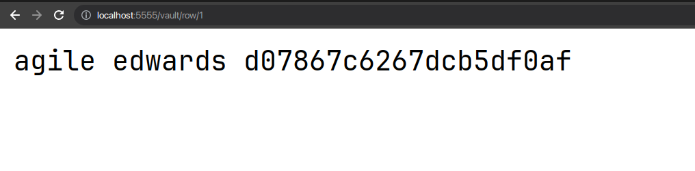

# \[Medium] Agile

## **Info**

<table><thead><tr><th>Name</th><th>Info</th><th data-hidden></th></tr></thead><tbody><tr><td>IP</td><td><mark style="color:blue;">10.129.171.197</mark></td><td></td></tr><tr><td>Domain</td><td><mark style="color:blue;">superpass.htb</mark></td><td></td></tr></tbody></table>

## **Services**


```bash
PORT   STATE SERVICE VERSION
22/tcp open  ssh     OpenSSH 8.9p1 Ubuntu 3ubuntu0.1 (Ubuntu Linux; protocol 2.0)
| ssh-hostkey: 
|   256 f4bcee21d71f1aa26572212d5ba6f700 (ECDSA)
|_  256 65c1480d88cbb975a02ca5e6377e5106 (ED25519)
80/tcp open  http    nginx 1.18.0 (Ubuntu)
|_http-server-header: nginx/1.18.0 (Ubuntu)
|_http-title: SuperPassword \xF0\x9F\xA6\xB8
Service Info: OS: Linux; CPE: cpe:/o:linux:linux_kernel
```


## Web

### Main page

<figure><figcaption></figcaption></figure>

<figure><figcaption></figcaption></figure>

### **Leaked app path**

<figure><figcaption></figcaption></figure>

### Inside registred account

<figure><figcaption></figcaption></figure>

### **Cookies**

| Name                                               | Value                                                                                                                                                                                                                                                                                                                                 |
| -------------------------------------------------- | ------------------------------------------------------------------------------------------------------------------------------------------------------------------------------------------------------------------------------------------------------------------------------------------------------------------------------------- |
| <mark style="color:purple;">session</mark>         | <mark style="color:green;">.eJwlTstqwzAQ\_BWx51D03LX8Fb2XECTtbmxwm2A5p5B\_r0Iu82CGYZ5w0a30RTrMP08wxyD4ld7LVeAE35uULma7Xc36Z46bKa2N0BzL2s19dL7g\_DqfxsgufYH52B8y3MowQ6KEEjIiUuVqWaY2CbmQSaLn5skm61wiV1UQw8SJSTB7bVEHop9ysrEmW7W5xOwapeLfEyw8FAblXDlE1UpZyKKWFjgGFziT9eP-5dFl\_7xxHl7\_E01GcA.ZAe8xQ.eeKuZVIyfmAdiMrKjGNYJ04gVtk</mark> |
| <mark style="color:purple;">remember\_token</mark> | <mark style="color:green;">12\|a7304ebbb81e83ee62f07550bdac6acb5b315624abbb84dcc1b7435dae353413a59a4f70034c9469acd4d2a0d5ff2cd45be790de047fce0bf168471d90f66aab</mark>                                                                                                                                                                |


### Cookies-Unsign



```bash
flask-unsign --decode --cookie '$COOKIE'
```

After cookie decode:

<figure><figcaption></figcaption></figure>

